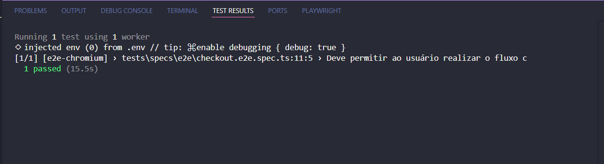
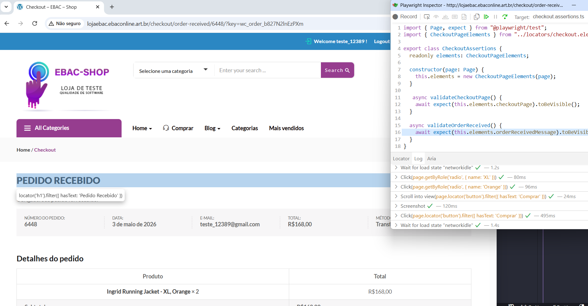
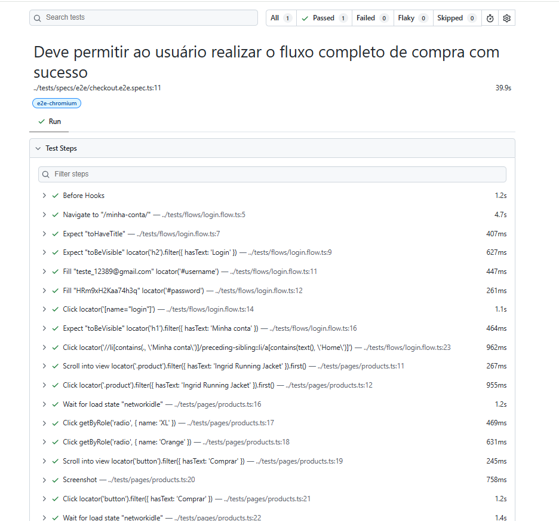

# Casos de Teste Mapeados

Site de teste utilizado: http://lojaebac.ebaconline.art.br/

## Cenários de Teste

### Testes Prioritários

- **Teste 01:** Registro de usuário (Register)
- **Teste 02:** Login de usuário
- **Teste 03:** Tentativa de adicionar produto ao carrinho sem selecionar tamanho e cor
- **Teste 04:** Redução da quantidade de itens no carrinho
- **Teste 05:** Remoção de item do carrinho
- **Teste 06:** Validação de cupom de desconto
- **Teste 07:** Validação do valor total do carrinho
- **Teste 08:** Validar controle de quantidade máxima no estoque
- **Teste 09:** Verificar se o botão “View all” está funcionando corretamente

## Critério de Escolha dos Testes

Os cenários foram selecionados com base no **impacto direto ao cliente** e no **risco para o negócio**, especialmente relacionados a:

- Prejuízos financeiros
- Perda de confiança na plataforma

## Análise de Impacto

### Abandono de Compra

Caso funcionalidades críticas não funcionem corretamente, por exemplo, adicionar ao carrinho, login, aplicar de cupom, há um alto risco de o cliente desistir da compra.

### Inconsistência de Valores no Front-end

Erros no cálculo do carrinho, assim como a aplicação incorreta de cupons de desconto, podem gerar divergências nos valores apresentados ao usuário. Essas inconsistências impactam diretamente a confiança do cliente na empresa, além de poderem resultar em prejuízos financeiros. Além disso, o controle da quantidade máxima em estoque também foi identificado como um cenário crítico. Falhas nessa validação podem permitir a venda de itens acima da disponibilidade real, gerando problemas operacionais, insatisfação do cliente e possíveis perdas financeiras.

## Classificação de Risco

Todos os cenários foram classificados como **ALTO RISCO**, pois impactam diretamente:

- Experiência do usuário
- Conversão de vendas
- Integridade dos valores

## Testes Não Priorizados

- **Teste 01:** Adicionar produtos à lista de desejos
- **Teste 02:** Validar filtro de pesquisa de itens
- **Teste 03:** Validar ordenação dos produtos

### Justificativa

Embora esses cenários sejam relevantes, não são críticos para o fluxo principal do sistema, pois não impactam financeiramente e ainda é possível o usuário realizar a compra no site corretamente. Por exemplo, a lista de desejos é uma funcionalidade secundária que auxilia o cliente na compra, mas não o impede de comprar. Filtro de pesquisa e ordenação de produtos também auxiliam na experiência do cliente, no entanto não gera impactos críticos.

## Desafio de Investigação

### Problema

Possível falha no funcionamento do filtro de tela.

### Hipótese Inicial

- Problema na **query de busca no banco de dados**

### Abordagem

1. Validar se a query está retornando os dados corretamente
2. Para validar a query ligada a essa funcionalidade:
   - Acionar o time de **back-end**
   - Solicitar apoio na validação da consulta

## Automação de Testes

Para a automação de testes foi escolhida a ferramenta Playwright + Typescript que é a ferramenta utilizada pela empresa. Além disso, a ferramenta Playwright é uma ótima escolha
pensando no tratamento de esperas inteligentes e a ferramenta de debugar o código Playwright Inspector. Já a escolha do Typescript serve para tipagem dinâmica, que auxilia encontrar erros no código de uma forma mais fácil.

### Instruções de instalação e execução

Pré-requisitos:

Ter NodeJS instalado na máquina
Ter uma ferramenta de edição de código instalada, como, Visual Studio Code (VSCode)
Ter o Git configurado na máquina para clonar o repositório

```
npm create playwright
```

**Durante a instalação, algumas perguntas serão exibidas:**
\*\*
**Deseja prosseguir?**
Responda Y (sim)

**Qual linguagem utilizar?**
Selecione TypeScript

**Onde os testes serão criados?**
Defina a pasta e2e, pois o projeto utilizará uma separação por tipos de teste (explicada posteriormente)

**Configurar GitHub Actions?**
Responda N (Não)

**Instalar os browsers do Playwright?**
Responda Y (sim)

**Estrutura gerada**

Ao final da instalação, serão criados arquivos importantes como:

package.json → gerenciamento de dependências do projeto
playwright.config.ts → configuração principal do Playwright

Também será criada uma pasta e2e, que contém um teste de exemplo gerado automaticamente. A pasta e2e pode ser removida, pois ela contém apenas um teste padrão utilizado para demonstrar a ferramenta.

Em playwright.config.ts exclua a linha testDir: './e2e e faça a seguinte alteração:

```
projects: [
    {
      name: "e2e-chromium",
      testDir: "./tests/specs/e2e",
      use: { ...devices["Desktop Chrome"] },
    },
    {
      name: "smoke-chromium",
      testDir: "./tests/specs/smoke",
      use: { ...devices["Desktop Chrome"] },
    },
    {
      name: "regression-chromium",
      testDir: "./tests/specs/regression",
      use: { ...devices["Desktop Chrome"] },
    },

    {
      name: "e2e-firefox",
      testDir: "./tests/specs/e2e",
      use: { ...devices["Desktop Firefox"] },
    },
    {
      name: "smoke-firefox",
      testDir: "./tests/specs/smoke",
      use: { ...devices["Desktop Firefox"] },
    },
    {
      name: "regression-firefox",
      testDir: "./tests/specs/regression",
      use: { ...devices["Desktop Firefox"] },
    },

    {
      name: "e2e-webkit",
      testDir: "./tests/specs/e2e",
      use: { ...devices["Desktop Safari"] },
    },
    {
      name: "smoke-webkit",
      testDir: "./tests/specs/smoke",
      use: { ...devices["Desktop Safari"] },
    },
    {
      name: "regression-webkit",
      testDir: "./tests/specs/regression",
      use: { ...devices["Desktop Safari"] },
    },
  ],
```

Isso vai servir para separar a execução do jeito que desejar, filtrando por pastas e navegadores.

```
npm -i --save-dev @types/node
```

Esse comando instala tipos do Node.js para o Typescript, pois o Typescript não entende
sozinho coisas do NodeJS como process, \_\_dirname..

Além disso, será necessário configurar o arquivo tsconfig.json com:

```
{
   "compilerOptions": {
   "types": ["node", "@playwright/test"]
   }
}
```

Isso serve para o Typescript reconhecer as definições do node citadas acima e também do playwright, como, test(), expect()..

### Estrutura do Projeto

Embora o site escolhido para automação não exija uma estrutura de alta escalabilidade por
se tratar de um site simples, nesse projeto foi utilizado um padrão para projetos médios e complexos pensando em escalabilidade, legilidade e reutilização de código. Assim, para
estrutura do projeto foi escolhido o padrão Page Objects Model (POM), para separar em pastas
as ações do teste, as validações e os elementos. Além disso, também foi utilizado o padrão
de fixtures para separar a massa de dados e as interfaces do typescript.

Assim, a estrutura do projeto está toda na pasta de testes, que é a pasta raiz.

Pasta specs é onde está localizado os testes de fato e está dividida em três outras pastas:
e2e - para testes end to end que cobrem um fluxo completo do sistema
regression - para testes que cobrem funcionalidades importantes e garantem estabilidade de boa
parte do sistema após alterações.
smoke - testes críticos e simples, para validar se o sistema está minimamente estável após alterações.

Pasta pages é onde está localizada a lógica de ação dos testes
Pasta locators é onde está localizado os elementos (xpathes e css selectors) dos testes. Foi
feito essa separação pensando em sistemas complexos onde há muitos elementos, visto que se
ficassem juntos em pages ficaria muitas linhas de código no mesmo arquivo e dificultaria
a manutenção.

Pasta fixtures é onde está localizado a massa de dados dos testes e também as interfaces
do typescript.

Pasta assertions é onde está localizado a parte de validações dos testes

Pasta flow é onde está localizado parte de fluxos muito utilizadas para reduzir o tamanho
dos steps dos testes principais e organizar de uma forma melhor.

### Criação do .env

Crie um arquivo na raiz do projeto chamado .env e coloque as credenciais de login (e-mail e senha):
USER_EMAIL=[Seu email aqui]
USER_PASSWORD=[Sua senha aqui]

Instale o dotenv

```
npm i dotenv
```

Não esqueça de adicionar o .env no .gitignore

Além disso, no arquivo playwright.config.ts descomente o código:  
import dotenv from 'dotenv';
dotenv.config();

### Problemas encontrados durante a execução

Durante a execução no modo headless o botão "Ver carrinho" não existia nesse modo, assim, foi necessário ir
até o ícone do carrinho, clicar nesse botão e logo após em "View Cart". Essa foi a maneira encontrada para que
fosse possível o teste "Deve permitir ao usuário realizar o fluxo completo de compra com sucesso" rodasse
no modo headless e headed.

### Comando para rodar suítes

Para rodar suítes em específico conforme o browser:

```
npx playwright test --project=e2e-chromium
```

Esse comando permite rodar apenas a suíte e2e com o chrome, por exemplo. Caso seja necessário rodar em outro
navegador basta substituir o parâmetro chromium. Além disso, se desejar rodar outra suíte como regression ou
smoke basta substituir o parâmetro e2e.

Esse comando vai rodar os testes no modo headless, ou seja, sem interface gráfica. Caso desejar acompanhar
com a UI, basta inserir o parâmetro --debug ao final do teste

Além disso outro comando para rodar todos os testes é o seguinte:
npx playwright test

Há também o comando:

```
npx playwright show-report
```

Esse comando serve para visualizar o log do teste.

### Evidência dos testes

**Execução do teste no modo headless**



**Execução do teste no modo headed com debug**



**Report do teste**



### Quando o teste der erro, o que fazer?

No playwright.config.ts é necessário por a seguinte configuração:

```
use: {
  screenshot: 'only-on-failure',
  video: 'retain-on-failure',
  trace: 'on-first-retry'
}
```

Essas configurações vão servir quando o teste falhar, por exemplo, o screenshot vai tirar
um print da tela. Já o vídeo grava um vídeo mostrando o erro e por fim o trace é um debug completo
caso o teste falhe.

Assim, você poderá ver no report do playwright o print, o vídeo e o trace.